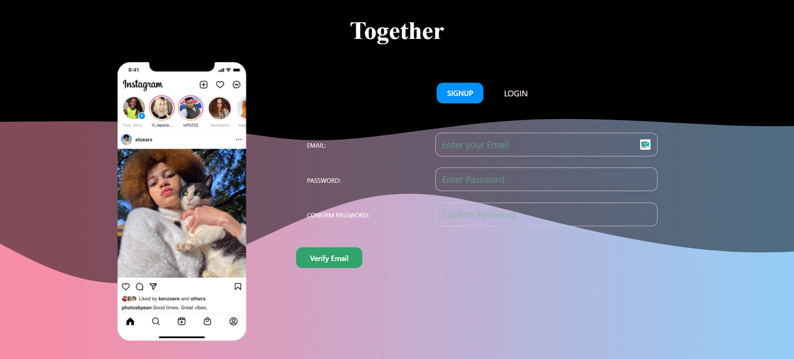
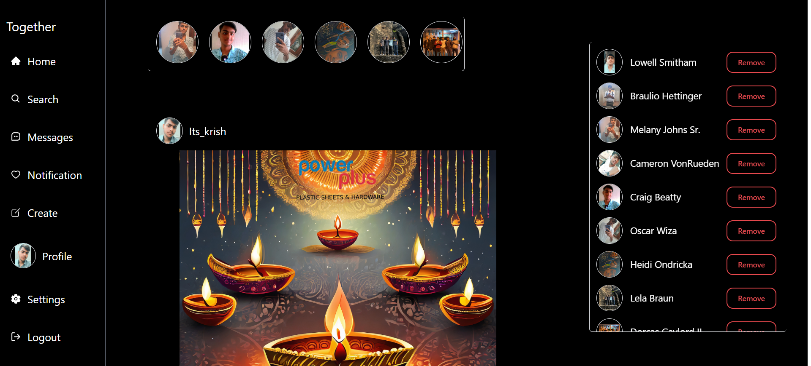
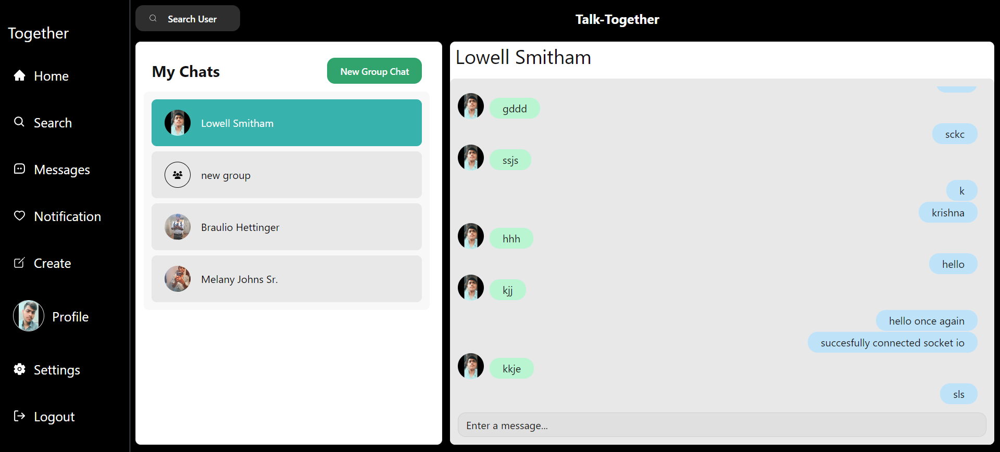
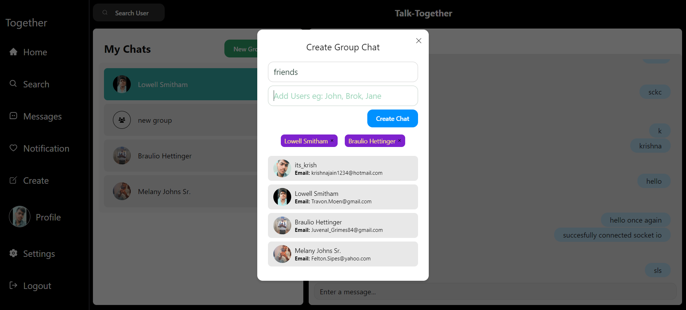

# Together

Welcome to our **Social Media App** Together! This application is designed to connect users through a range of features, leveraging real-time communication and providing an interactive platform for social interactions.


## Technology

**MERN-stack**

**Client:**<br/>


**Server:** <br/>

 
 


## Features

- User Authentication && Authorisation
- Profile Creation && Updation
- Social Media Post Sharing && Story viewing
- Real time Messaging One-one-one && Group Chat
- Completely Responsive
- Built On Dark Mode


## Screenshots







## API Reference
Visit https://together-3i3j.onrender.com/api-docs to Read the RESTFUL api swagger documentation for the app
## Run Locally

Clone the project

```bash
  git clone https://github.com/krishna4040/Together.git
```

Go to the project directory

```bash
  cd together 
```

Install dependencies in root directory and server directory

```bash
  npm install
```

Make sure to make .env file with following env variables in root directory

```bash
  VITE_BASE_URL = http://localhost:4000/api/v1
  PORT = 4000
  DB = mongodb://127.0.0.1:27017/together
  Cloudinary_CLOUD_NAME = <Your credentials>
  Cloudinary_API_KEY = <Your credentials>
  Cloudinary_API_SECRET = <Your credentials>
  Cloudinary_FOLDER = <Your credentials>
  MAIL_HOST = <Your credentials>
  MAIL_USER = <Your credentials>
  Mail_pass = <Your credentials>
  JWT_SECRET = <Your credentials>
```


Start the server and run vite app using concurrently by running

```bash
  npm run start
```


## Contributing && Future Improvements

Contributions are always welcome!

I am looking forward to Integrate and looking forward to ask for contributions regarding 

- Real time Audio video communication using `webrtc`
- In memory cache management using `Redis-stack`
- Using `Next` to increase SEO and get the app production ready
- Dockerising App using `Docker`
- Building CI/CD pipleline using `Github Actions`
- Using Ai models to integrate ai in social media App


## Feedback

If you have any feedback, please reach out to us at krishnajain5050@gmail.com, Thanks For reading!!!

