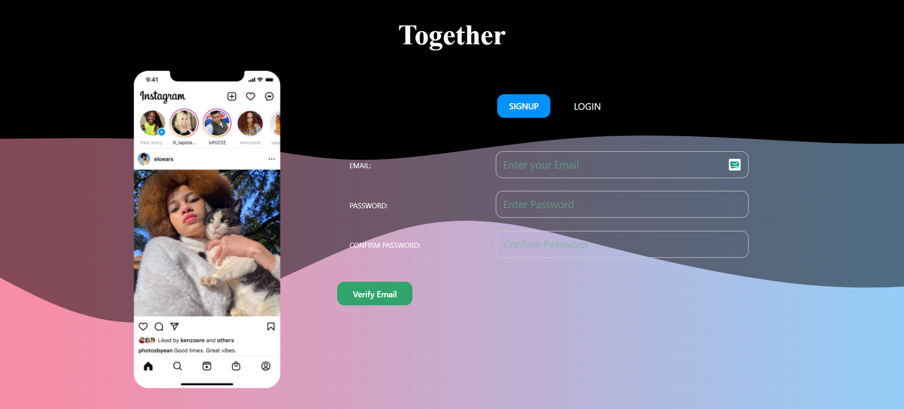
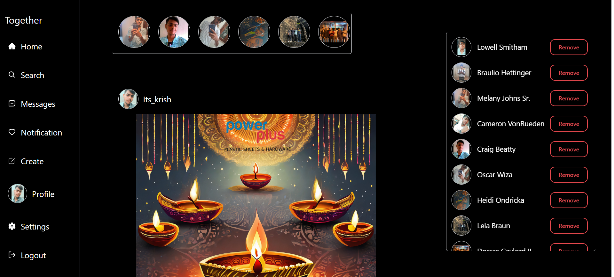
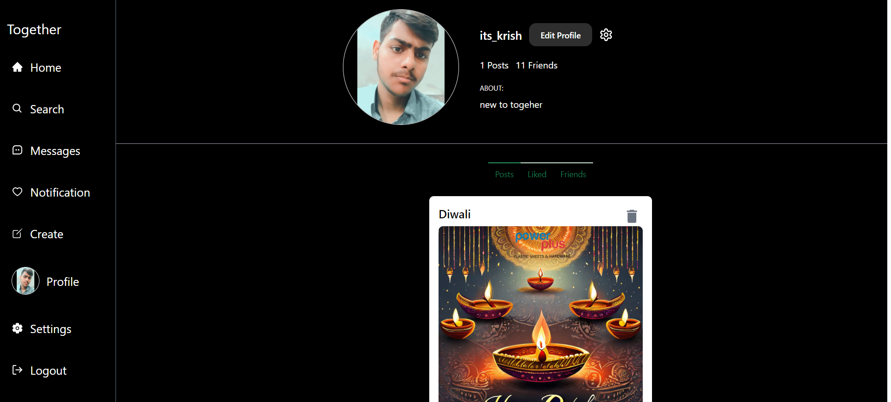
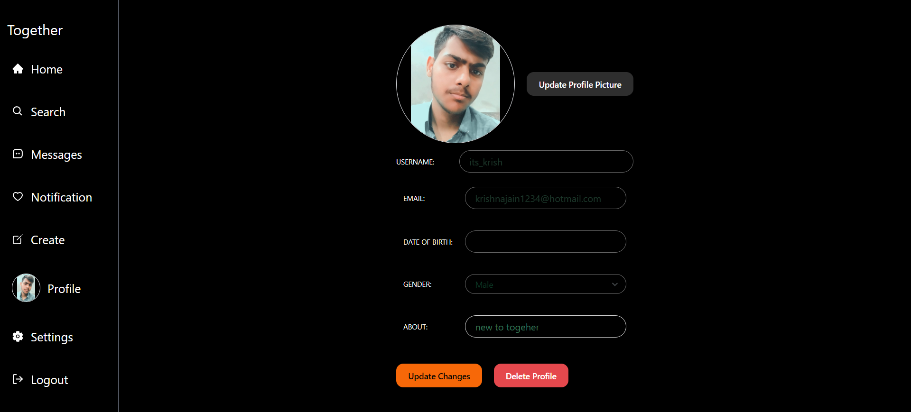
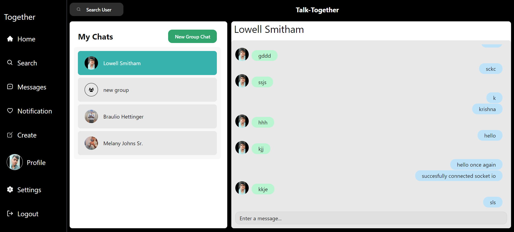
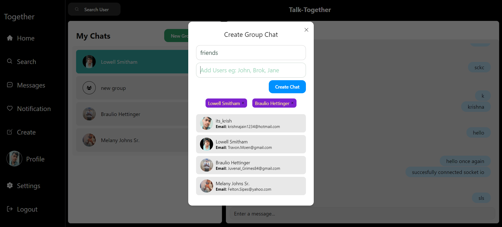

# Together

Welcome to our Social Media App Together! This application is designed to connect users through a range of features, leveraging real-time communication and providing an interactive platform for social interactions.

## Table of Contents

- [Technologies Used](#technologies-used)
- [Features](#features)
- [Getting Started](#getting-started)
- [Contributors](#contributors)

## Technologies Used

- **MERN Stack**
  - MongoDB: Database for storing user information, posts, and related data.
  - Express.js: Backend framework for building RESTful APIs.
  - React.js: Frontend library for creating interactive user interfaces.
  - Node.js: Runtime environment for executing JavaScript code on the server.

- **Web Socket**
  - Utilized for real-time communication in chats and group chats.

- **WebRTC**
  - Employed for peer-to-peer connections, enabling video/audio communication directly between users.

## Features

### Authentication and Authorization
Secure login and registration system with authentication mechanisms.
Different user roles and permissions for authorization control.

### Profile Creation
Users can create their profiles with personal information, avatars, and other details.

### Making Friends
Users can send and accept friend requests, building connections within the platform.

### Stories (Visible for 24 hours)
Users can post temporary stories that are visible to friends for 24 hours.

### Creating and Sharing Posts
Ability to create text, image, or video posts.
Share posts publicly or with selected friends.

### Viewing and Searching Users
Explore and search for other users registered on the platform.

### Profile Management
Users can update their profile details, including personal information and avatars.
Manage login credentials and security settings.

### Real-Time Communication in Chats
Real-time messaging with individual users.

### Group Chatting Functionality
Group chatting functionality with real-time updates.
Admin privileges for managing and moderating group chats.

## Getting Started

To run the application locally:

1. Clone this repository.
2. The main app is frontend and the server directory is itself a node application
3. Install dependencies using `npm install` in root and server directory.
3. Set up MongoDB and update connection details in the configuration files.
4. Run the devlopment server using `npm run dev` for the backend in server dir and `npm run dev` for the frontend in root dir.

## Contributors

- [Krishna Jain]

## Open Contributions

Contributions are welcome! After cloning the repository, users can submit a pull request specifying new features or reporting and fixing bugs. Please follow the contribution guidelines outlined in CONTRIBUTING.md.